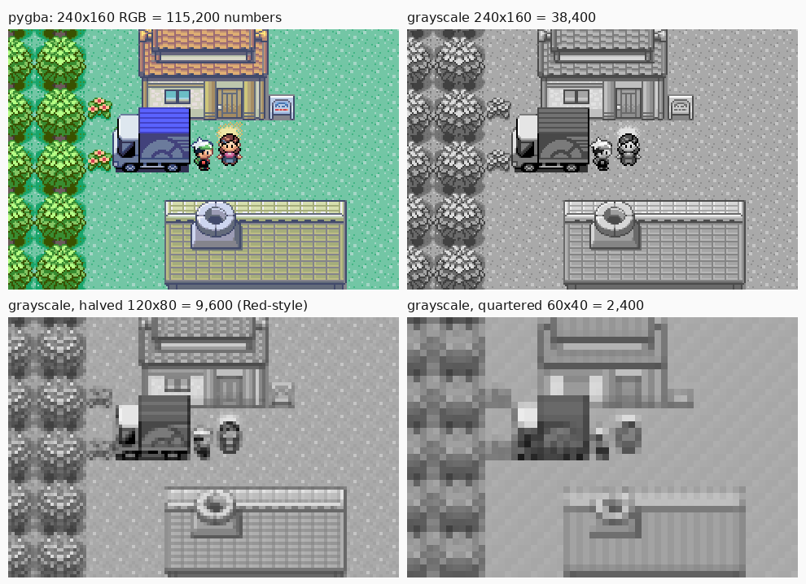

# Learning guide

A study companion to the project. Each part explains one piece of the pipeline,
points at the code that implements it (ours or the reference repos in `~/refs/`),
and ends with notes for the YouTube video. It grows as the project does, and
the log at the bottom records what changed and when.

Sources for everything here are in
[`docs/research/2026-10-02-deep-research.md`](docs/research/2026-10-02-deep-research.md).

**Contents**

1. [The whole loop on one page](#1-the-whole-loop-on-one-page)
2. [Reinforcement learning in the smallest number of ideas](#2-reinforcement-learning-in-the-smallest-number-of-ideas)
3. [Advantage and GAE](#3-advantage-and-gae)
4. [PPO itself](#4-ppo-itself)
5. [The network](#5-the-network) (with 5a: choosing the buttons, 5b: choosing the picture)
6. [The emulator: how a GBA becomes a gym environment](#6-the-emulator-how-a-gba-becomes-a-gym-environment)
7. [Reading Emerald's memory](#7-reading-emeralds-memory)
8. [Reward design, and how agents cheat](#8-reward-design-and-how-agents-cheat)
9. [Getting unstuck](#9-getting-unstuck)
10. [Reading the training curves](#10-reading-the-training-curves)
11. [What to look for in the replays](#11-what-to-look-for-in-the-replays)
12. [How the visuals are made](#12-how-the-visuals-are-made)
13. [Reading and watching list](#13-reading-and-watching-list)
14. [Our code, file by file](#14-our-code-file-by-file)
15. [Log](#15-log)

---

## 1. The whole loop on one page

```
            ┌──────────── observation (screen, map crop, badges, …) ───────────┐
            │                                                                   ▼
   ┌─────────────────┐   action (one button)   ┌────────────────┐     ┌──────────────┐
   │ mGBA emulator   │ ◀────────────────────── │ policy network │ ◀── │ observation  │
   │ runs 24 frames  │                         │ (CNN + LSTM)   │     │ encoder      │
   └────────┬────────┘                         └───────┬────────┘     └──────────────┘
            │ RAM after the step                       │ value estimate V(s)
            ▼                                          ▼
   ┌─────────────────┐   reward r              ┌────────────────┐
   │ reward function │ ──────────────────────▶ │ rollout buffer │ ── every N steps ──▶ PPO update
   │ (reads RAM)     │                         │ (s, a, r, V)   │                       (changes the
   └─────────────────┘                         └────────────────┘                        network)
```

One **step** is one decision. The agent picks a button, the emulator holds it
for 8 frames and releases it for 16, and then we read the screen and RAM. Many
copies of the game run at once in separate processes (one per CPU core). Their
steps fill a buffer, and once it is full PPO uses it to nudge the network
toward actions that turned out better than expected. Then the buffer is thrown
away and refilled with the updated network. That is the entire algorithm. The
rest of this guide is detail.

In Red V2 the numbers are 64 games × 2,560 steps = 163,840 steps per update.
See `~/refs/PokemonRedExperiments/v2/baseline_fast_v2.py`.

> **Video note.** This diagram is the spine of the video. Every later section
> zooms into one box.

---

## 2. Reinforcement learning in the smallest number of ideas

**State, action, reward.** At time *t* the game is in state *s_t*, the agent
takes action *a_t*, and gets reward *r_t*. The **policy** π(a | s) is a
probability distribution over the 7 buttons given what the agent sees.

**Return.** The agent doesn't care about one reward. It cares about the
discounted sum from now on:

$$G_t = r_t + \gamma r_{t+1} + \gamma^2 r_{t+2} + \dots$$

**γ (gamma) sets how far ahead the agent looks.** A reward *k* steps away is
worth γᵏ of a reward now. A useful rule of thumb is that the horizon is about
1 / (1 − γ) steps:

| | γ | horizon in steps | in game time (24 frames/step at 59.7 fps) |
|---|---|---|---|
| SB3 default | 0.99 | 100 | 40 s |
| Red V2 | 0.997 | 333 | 2.2 min |
| pokemonred_puffer | 0.998 | 500 | 3.3 min |

This is why gamma is so high in Pokémon. Walking from Littleroot to Oldale and
getting a reward there takes a minute or more, and an agent with γ = 0.99
barely "sees" it.

**Value function.** V(s) is the network's guess of G_t from state s, meaning how
good this situation is. It's learned alongside the policy and used to judge
whether an action was better or worse than usual.

> **Video note.** The gamma table is a great 20-second graphic: three bars,
> labelled in real game time.

---

## 3. Advantage and GAE

The policy should do more of an action if the outcome was **better than
expected**. That "better than expected" is the **advantage** A_t.

The simplest one-step version is the **TD error**:

$$\delta_t = r_t + \gamma V(s_{t+1}) - V(s_t)$$

This is what I got (r_t, plus the value of where I ended up) minus what I
expected V(s_t). It's low-variance but biased, because V is only a guess.

The other extreme is the full Monte Carlo return, G_t − V(s_t). It's unbiased
but noisy, because a thousand later random button presses all feed into it.

**GAE** (Generalized Advantage Estimation, Schulman et al. 2015) blends the two
with a second knob, λ:

$$A_t = \delta_t + (\gamma\lambda)\,\delta_{t+1} + (\gamma\lambda)^2\,\delta_{t+2} + \dots$$

It's computed backwards through the buffer in one pass:

```python
adv = 0
for t in reversed(range(T)):
    nonterminal = 1 - done[t]
    delta = r[t] + gamma * V[t+1] * nonterminal - V[t]
    adv = delta + gamma * lam * nonterminal * adv
    A[t] = adv
returns = A + V[:T]          # targets for the value function
```

λ = 0 gives the plain TD error, and λ = 1 gives the full return. Everyone in
this space uses about 0.95, and Red V2 keeps the SB3 default of 0.95.

> **Video note.** Animate the backwards loop over a row of boxes, each one
> passing a shrinking share of its δ to the box on its left.

---

## 4. PPO itself

The plain policy gradient says to raise log π(a_t | s_t) in proportion to A_t.
The trouble is that one large step can wreck the policy, and since the data came
from the old policy, a wrecked policy can't recover from it.

PPO (Schulman et al. 2017) limits each update. For every stored step it
computes the **probability ratio** between the new and old policy:

$$\rho_t(\theta) = \frac{\pi_\theta(a_t \mid s_t)}{\pi_{\text{old}}(a_t \mid s_t)}$$

and maximises the **clipped surrogate**:

$$L^{\text{CLIP}} = \mathbb{E}_t\Big[\min\big(\rho_t A_t,\ \operatorname{clip}(\rho_t,\,1-\epsilon,\,1+\epsilon)\,A_t\big)\Big]$$

Two worked cases with ε = 0.2:

- **Good action, A = +2.** If the update already raised its probability by 50%
  (ρ = 1.5), then min(1.5 × 2, 1.2 × 2) = 2.4, a constant. **The gradient is
  zero**, and PPO stops pushing this action once it's 20% more likely.
- **Bad action, A = −2,** with probability already halved (ρ = 0.5):
  min(0.5 × −2, 0.8 × −2) = −1.6, again constant, so it stops pushing it down.

The `min` makes the clip one-sided. It only stops the policy from moving *too
far in the helpful direction*. If an update accidentally made a bad action more
likely, the loss still pulls it back.

The full loss that gets minimised:

$$\mathcal{L} = -L^{\text{CLIP}} + c_v\,\big(V_\theta(s_t) - \hat R_t\big)^2 - c_e\,\mathcal{H}\big[\pi_\theta(\cdot \mid s_t)\big]$$

- The **value loss** (c_v = 0.5) trains V toward the GAE returns.
- The **entropy bonus** (c_e = 0.01 in both Red V2 and puffer) rewards keeping
  the action distribution spread out. Without it, the agent settles on one
  button too early and stops exploring. In a game this long, that is fatal.

**One update** shuffles the buffer, cuts it into minibatches, and takes a
gradient step on each. It passes over the buffer `n_epochs` times.

| Setting | SB3 default | Red V2 | pokemonred_puffer |
|---|---|---|---|
| steps per update | 2,048 × envs | 2,560 × 64 = 163,840 | 65,536 |
| minibatch | 64 | 512 | 2,048 |
| epochs | 10 | **1** | 3 |
| learning rate | 3e-4 | 3e-4 | 2e-4 |
| γ / λ | 0.99 / 0.95 | 0.997 / 0.95 | 0.998 / 0.95 |
| clip ε | 0.2 | 0.2 | 0.1 |
| entropy | 0 | 0.01 | 0.01 |
| memory | — | 3 stacked frames | LSTM, 16-step BPTT |

Red V2 uses a single epoch over a huge buffer. That is a cautious choice: each
sample is used once, so the ratio never drifts far from 1, and the cost is
needing more samples.

Code to read: SB3's `PPO.train()` (in `.venv/lib/python3.10/site-packages/stable_baselines3/ppo/ppo.py`)
is about 100 readable lines. It is the best single place to see these formulas
as tensors.

> **Video note.** The two worked cases show the clip better than the formula
> does. Plot ρA against ρ with the flat region shaded.

---

## 5. The network

**Red V2** (`MultiInputPolicy` in SB3): a small CNN over three stacked 72×80
grayscale screens, plus small MLPs over the other observation parts, all
concatenated into a policy head (7 logits) and a value head (1 number).

**Why give it memory?** A single screen doesn't tell you where you've been or
whether you just talked to that NPC. There are two ways to add memory:

- **Frame stacking**: feed the last *k* screens. It's simple, but the input grows
  linearly with *k*, so in practice the memory is a few seconds.
- **Recurrent (LSTM/GRU)**: a hidden state carries information forward
  indefinitely. pokemonred_puffer moved to an LSTM (CNN → 512 linear → LSTM)
  for exactly this reason, and the second-place Emerald team (Hamburg
  PokéRunners) used recurrent PPO too. The cost is that training has to replay
  sequences (BPTT, 16 steps in puffer), and SB3's main PPO doesn't support it.
  SB3-contrib's `RecurrentPPO` and PufferLib both do.

**The other trick in both repos is the visited-tiles crop.** Red V2 gives the
network a 48×48 crop of its own exploration map centred on the player. The agent
can literally see which nearby tiles it has already walked on, which makes
"go somewhere new" a learnable visual pattern rather than a memory problem.
PokeRL's preprint reports the same idea raised unique tiles per episode from 34
to 48.

> **Video note.** Put the four inputs side by side (full screen, the network's
> 72×80 view, the visited crop, the stats vector). PWhiddy's video does this,
> and it's memorable.

### 5a. Choosing the buttons (the action space)

The **action space** is the menu the agent picks from at every step. pygba
offers every combination of one arrow (or none) and one button (or none):
5 × 7 = **35 actions**. Red offers **7**: the four arrows, A, B and START.

Tested on the real game (inside the truck, 2026-10-03):

| button | what it does in the overworld early on |
|---|---|
| arrows | walk (or only turn, if facing another way) |
| A | talk, read signs, confirm |
| B | cancel; later, hold to run |
| START | opens BAG / RL / SAVE / OPTION / EXIT. A detour, and OPTION can undo our fast-text setting |
| SELECT | shows "An item in the BAG can be registered to SELECT…", a text box that costs extra presses to clear |
| L, R | **nothing** |
| arrow + button combos | near-duplicates of the single buttons |
| nothing pressed | wastes 24 frames |

**Why more actions makes learning harder:**

1. **Random exploration gets diluted.** A fresh network picks roughly uniformly
   at random. Leaving a building might take 5 particular presses in a row. With
   7 actions the chance of hitting them by luck is 1 in 7⁵ = 16,807. With 35
   it's 1 in 35⁵ = 52.5 million, **3,125× rarer**. Early learning depends on
   these lucky accidents happening often enough to be rewarded.
2. **The same lesson has to be learned several times.** "Up" and "Up+L" do
   the same thing, but to the network they're unrelated outputs. Whatever it
   learns about one doesn't carry over to the other.
3. **Entropy is spread thinner.** The entropy bonus (section 4) keeps the
   policy random. With 35 actions, most of that randomness goes on buttons that
   do nothing. Maximum entropy is ln 35 = 3.56 against ln 7 = 1.95.

**Our choice: 7 actions, UP, DOWN, LEFT, RIGHT, A, B, START**, the same as Red.
START stays because the menu is a real part of the game (bag, party, HMs
later), and the agent should learn *when* it's worth opening instead of having
it taken away. L and R do nothing, and SELECT is only a shortcut to an item
you can already use via START → BAG, so dropping those three removes no
ability.

**Discouraging harm without rules.** Some menu entries can cause real harm.
OPTION can switch text back to slow or battle animations back on, which
wastes time for the rest of the episode. Instead of blocking the menu, we
use the reward, with three design decisions:

1. **Penalise the outcome, not the button.** If pressing START (or entering
   OPTION) were punished, the simplest thing for the network to learn is
   "never open the menu", which is the opposite of what we want. The harm is
   the *settings changing*, and we can read that directly: the settings are one
   16-bit value at `SaveBlock2 + 0x14` (text speed in bits 0–2, battle style
   bit 9, animations-off bit 10). Verified on our savestates: `0x0001`
   (MID/SHIFT/ON) before setup and `0x0602` (FAST/SET/OFF) after.
2. **Keep it moderate.** Huge penalties backfire. Early random play will hit
   them often, so they dominate learning, make the agent avoid everything near
   them, and make the value network's targets swing wildly. Size a penalty to
   the harm it stands for: slow text costs time, so a few tiles' worth of
   exploration reward.
3. **Refund it when undone (potential-based).** −P when the settings move away
   from ours, +P when they're restored. Breaking and fixing costs nothing,
   leaving them broken costs P, and the agent can learn to repair them. This
   is the Ng et al. shaping form from section 8, so it doesn't change which
   strategy is best overall.

Wasted time is a cost on its own: steps spent in menus aren't spent
exploring, so the agent learns menus pay off only when they lead somewhere.
That's how Red's agents handled START with no penalty at all.

| menu entry (early game) | possible harm | handling |
|---|---|---|
| OPTION | slower text / animations back on | refundable penalty |
| SAVE | none (we use savestates) | none; just costs time |
| BAG → TOSS | loses Potions / Poké Balls | later, when items matter |
| POKéMON → reorder | could help | none |

### 5b. Choosing the picture (the observation)

The GBA screen is 240×160 pixels in colour (3 numbers per pixel: red, green,
blue). Red's agents see a much smaller version. The comparison below is from
our Littleroot savestate (`docs/images/observation_resolutions.png`):



| observation | numbers per frame | what's still visible |
|---|---|---|
| full colour, 240×160 (pygba) | 115,200 | everything |
| grayscale, 240×160 | 38,400 | everything except colour |
| **grayscale, halved, 120×80** (Red-style) | **9,600** | doors, signs, trees, both characters, the truck |
| grayscale, quartered, 60×40 | 2,400 | rough shapes; the player is a blob, the sign is gone |

**Why it matters:**

1. **Memory.** PPO keeps every observation from a rollout until the update.
   SB3 stores them as bytes, one per number. At Red V2's buffer size (163,840
   steps):
   - full colour: 163,840 × 115,200 = **17.6 GiB**, over half the VM's 31 GB
   - halved grayscale with 3 frames stacked: **4.4 GiB**
   - halved grayscale, one frame (if memory comes from an LSTM instead): **1.5 GiB**
2. **Compute.** The network's first layer does work for every input number.
   Going from 115,200 to 9,600 numbers makes it about **12× cheaper**, and we
   train on CPUs, which compete with the emulators for the same cores.
3. **Learning.** A smaller input has fewer irrelevant details to learn to
   ignore. A GBA tile is 16 pixels across, so halving keeps each tile 8
   pixels wide, still recognisable. Quartering to 4 pixels starts to merge
   things that matter.

**What grayscale loses:** in this frame, 68 distinct colours become 58 gray
levels, so a few different colours turn into the same gray. That's fine here,
but some Emerald areas use colour to separate things (water, tall grass, cave
floors). **We'll check it on Route 101's tall grass** before committing, and
fall back to colour or a third-resolution if needed.

**The screen isn't the whole observation.** Like Red, we also give the network
facts read from RAM, which are cheap and exact: a crop of the tiles it has
already visited around the player, party HP, levels, badges and milestone bits.
The settings value from 5a goes in too, so the network can *see* that the
settings are wrong, rather than only being penalised for it.

**Our choice:** 120×80 grayscale, 3 stacked frames for the first version
(simple, works in plain SB3 PPO, same as Red), plus the RAM facts. We'll move
to an LSTM once the pipeline works.

---

## 6. The emulator: how a GBA becomes a gym environment

**The hardware we're emulating:** a 16.78 MHz ARM7TDMI CPU, a 240×160 screen,
about 59.73 frames per second. **mGBA** emulates it in C. We drive it from
Python through its official bindings (built from source, see `SETUP.md`), and
**pygba** wraps that in the Gymnasium `reset()` / `step()` interface.

**A step**, in our version and Red's:

```
set_keys(button)        # press
run_frame() × 8         # hold for 8 frames
set_keys()              # release
run_frame() × 16        # let the game react (walk animation finishes, text advances)
read screen + RAM       # observation and reward
```

Why 24? One tile of walking takes 16 frames, so 24 frames means one press is
one tile, plus a margin. Shorter steps waste decisions on animations, and longer
ones make menus sluggish.

**Savestates** are snapshots of the whole machine (CPU, RAM, video) as one blob
of about 388 KiB. On our VM, saving takes about 14 µs and loading about 17 µs.
Every episode starts from a savestate rather than the title screen, and swarming
(section 9) relies on them being cheap.

**Our starting savestate is `states/01_mudkip.state`**: standing in Birch's lab
with a level 5 Mudkip, like Red's agents start with their starter. Everything
before that point is fixed dialogue (Mom, the clock, May's house, the rescue
on Route 101), so the agent would learn nothing from it and would have to
repeat it every episode. It's rebuilt from power-on by replaying
`scripts/intro.keys` and then `scripts/starter.keys`.

**The cartridge clock (a determinism trap).** Emerald cartridges have a
real-time clock chip, and by default mGBA feeds it this machine's real date.
Replaying the intro four days after recording it changed 11 bytes of game
RAM. Nothing visible changed, but runs then depend on *when* they ran.
`drive.py`'s `pin_clock` switches mGBA to `RTC_FAKE_EPOCH`: the clock starts at
2026-01-01 12:00 and advances with *emulated* frames. Now two runs from
power-on give byte-identical savestates. The environment must call the same
function.

**Measured speed on our VM** (`scripts/bench_emulator.py`, random buttons, 24
frames per decision):

| processes | Emerald, Littleroot overworld: frames/s each | decisions/s each | decisions/s total | test ROM (idle): decisions/s total |
|---|---|---|---|---|
| 1 | 2,481 | 96 | 96 | 404 |
| 8 | 2,385 | 92 | 737 | 3,102 |
| 16 | 1,461 | 56 | **900** | 3,271 |

There are two lessons here:

- **Real games cost real CPU.** The test ROMs mostly sit idle, which mGBA can
  skip through. Emerald keeps the emulated CPU busy every frame, so it runs
  about 4× slower.
- **Hyperthreads help a little.** The VM's 16 vCPUs are 8 physical cores × 2
  hyperthreads. Going from 8 to 16 processes adds about 22% for Emerald, much
  less than doubling. Budget with physical cores, then treat the
  hyperthreads as a small bonus.

What this means for planning: **100M steps ≈ 31 hours** on this VM at 900
decisions/s. The README §3 range (40–140 decisions/s per core) turned out
about right. On top of that, pygba's reward function costs 2.5 ms per step,
another ~25%, which our own environment will avoid.

> **Video note.** "Each of these little games is running about 40× faster than
> a real Game Boy Advance" (2,481 fps / 59.7).

---

## 7. Reading Emerald's memory

The reward and part of the observation come from reading RAM, not pixels. GBA
memory is split into regions by address:

| Address | Region | Size | What lives there |
|---|---|---|---|
| `0x02000000` | EWRAM | 256 KB | save blocks, party, most game state |
| `0x03000000` | IWRAM | 32 KB | fast variables, including the **pointers** to the save blocks |
| `0x08000000` | ROM | 16 MB | the game itself, read-only data tables (species, exp curves) |

**Red vs Emerald.** In Red, the player's X coordinate is always at `0xD362`. You
read one byte and you're done. Emerald adds two complications:

1. **The save blocks move.** Emerald keeps `SaveBlock1` (position, flags, bag)
   and `SaveBlock2` (pokédex, encryption key) at an address that the game
   itself shifts by a random offset at certain points. This "DMA protection" was
   an anti-cheat-device measure. The fix is to read the **pointer** first:
   `gSaveBlock1Ptr` at `0x03005d8c` (IWRAM, fixed), then read the block at the
   address it points to. pygba does this correctly.
2. **Pokémon data is encrypted.** Each Pokémon's 48-byte data block is XOR'd
   with `otId ^ personality`, then split into 4 substructures (growth, attacks,
   EVs, misc) whose **order** is one of 24 permutations chosen by
   `personality % 24`. pygba's `parse_box_pokemon` undoes both steps.

Where the addresses come from: the **pokeemerald decompilation** (`pret/pokeemerald`),
a full C reconstruction of the game. Its build produces a symbol table
(`pokeemerald.sym`) that names every variable and its address, and its headers
(`include/global.h`, `include/pokemon.h`) give the struct layouts. This is the
Emerald equivalent of Red's datacrystal RAM map, and it's more complete.

**Flags** are single bits in `SaveBlock1.flags` (300 bytes). The decomp names
them: badges at `0x867–0x86E`, "visited Oldale" at `0x870`, trainer-defeated
flags from `0x500`, and so on. Their position in the game's progress is what
makes them good milestone rewards.

**Verified on the real ROM (2026-10-02)**, by playing through the intro with
`scripts/drive.py`:

- `SaveBlock1.location` gives (bank, num). The truck reads `25.40`
  (`InsideOfTruck`) and outside reads `0.9` (`LittlerootTown`), both matching
  the decomp's `map_groups.json` order and our generated `map_data.json`.
- `SaveBlock1.pos` updates **every step**, in map-local tiles. Walking right
  in the truck reads (2,2) → (3,2) → (4,2), so it's safe for exploration
  rewards.
- **159 script flags are already set** when the truck scene starts, and
  walking around the truck flipped that to 164 with no story progress. The
  event reward must subtract a starting count and use "max so far" (section 8).
- A short tap in a new direction **turns the player without moving**. Some
  actions therefore change nothing but facing, which the agent has to learn.

> **Video note.** The shuffled-pointer and encrypted-Pokémon story is good
> Emerald-specific material that Red's video doesn't have. Show a hex view of
> the same Mudkip before and after decryption.

---

## 8. Reward design, and how agents cheat

The reward function is the only way to tell the agent what you want, and it
will find the cheapest way to get it. Every term is a possible exploit.

**Red V2's reward** (all × 0.5):

| term | weight | what it pays for |
|---|---|---|
| event | 4 per flag | story progress (any event flag newly set) |
| explore | 0.025 per tile | each new (x, y, map) visited |
| badge | 10 | gym badges |
| heal | 10 × (heal amount)² | HP restored, i.e. visiting a Pokémon Center |
| stuck | −0.05 per step | standing on a tile visited more than 600 times |

**The rule that makes rewards safe: pay for reaching new highs, never for
changes.** Red computes the event reward as
`max(events_set_now − events_set_at_start)` over the episode. It can only go up,
so there is nothing to farm. This is a special case of **potential-based
shaping** (Ng, Harada & Russell, 1999): reward of the form
F = γΦ(s′) − Φ(s) for some score Φ doesn't change which policy is optimal, and
"best progress so far" behaves like such a score.

**Case study 1: Mr. Briney's boat (Emerald).** dvruette's Emerald agent reached
the second gym, then spent its time riding the boat between Route 104 and
Dewford. Reading pygba's reward code shows why. It adds up the number of
*changed* script flags (`old XOR new`) into a running total. Cutscenes set and
clear temporary flags, so every boat ride flips the same flags again and pays
again. Swap XOR-accumulation for Red's "max of set flags" and the exploit
disappears. This is our first fix.

**Case study 2: Zubats in Mt. Moon (Red, Pleines et al.).** With a healing
reward on, a Bulbasaur agent learned to sit in Mt. Moon trading Leech Seed
against Zubats' Leech Life, healing and getting hurt over and over. The ablation
also found that removing the *level* reward slightly increased milestones
reached, and removing navigation reward meant reaching none at all.

**Design rules for our Emerald reward:**

1. Every term is monotone: "max so far" or "count of distinct things".
2. Milestones pay once: the 15 PokéAgent Challenge milestones (Littleroot →
   Roxanne) as one-time bonuses.
3. Exploration is keyed on (bank, num, x, y), with indoor and outdoor treated
   alike.
4. Levels are capped or have diminishing returns (Red uses full value up to
   22, then ÷4).
5. Drop raw healing. If it's needed, pay only for "healed at a Pokémon Center
   after being low".
6. Log every term separately, so a spike in one is visible on the dashboard.

> **Video note.** Mr. Briney deserves its own segment: replay footage, the
> reward graph climbing with no progress, the three lines of code that cause it,
> and the one-line fix.

---

## 9. Getting unstuck

Exploration rewards dry up. Once the nearby tiles are seen, there's nothing to
gain until the agent gets past some obstacle. It's like a gradient going to zero:
the agent wanders. These are the tools, roughly from cheapest to most powerful:

- **Stuck penalty** (Red V2): a small negative reward for standing on a tile
  you've visited hundreds of times.
- **Anti-loop wrappers** (PokeRL, preprint): penalise revisiting a tile more
  than 3 times, repeated action patterns in the last 20 actions, and position
  cycles. Reported loop episodes fell from 41% to 5%.
- **Decaying exploration memory** (puffer `DecayWrapper`): the "seen" value of
  each tile slowly fades (× 0.9995 every 10 steps, floor 0.15), so old areas pay
  a little again. Exploration never fully dries up.
- **Episode length vs savestates**: reset often enough that bad episodes
  don't waste compute, but start each episode from a savestate that's already
  far along.
- **Swarming** (puffer, inspired by Go-Explore): when *any* agent reaches a
  new required milestone, save its state and make **every** agent load it.
  The whole population jumps forward at once and trains on the new frontier
  instead of re-learning the start. This is what took pokemonred_puffer from
  "reaches Cerulean" to "beats the game". Our measured 17 µs savestate load
  means it's essentially free.
- **Scripting the boring parts** (puffer: auto-cut, auto-surf, auto-strength):
  if a mechanic is a menu chore rather than a decision, do it in code. The
  research README allows "some deterministic rules on top", and this is where
  they belong. Each one is a fair point for critics, so list them in the video.

> **Video note.** Swarming is a great visual. Show the shared map with dots
> spread everywhere, then all of them snap to the same spot when one agent
> enters Rustboro Gym.

---

## 10. Reading the training curves

TensorBoard (`tensorboard --logdir runs/`, free and local) shows these. What
healthy looks like:

| metric | meaning | healthy | trouble |
|---|---|---|---|
| `approx_kl` | how much one update changed the policy | ~0.005–0.03 | > 0.05: updates too large; ~0: not learning |
| `clip_fraction` | share of samples where the clip kicked in | 0.05–0.2 | > 0.3: lower the learning rate |
| `entropy_loss` | action randomness | falls slowly | collapses fast: more `ent_coef` |
| `explained_variance` | 1 − Var(R − V)/Var(R): does V predict returns? | rising toward 0.5–0.9 | ≤ 0: value net is useless; check reward scale |
| `value_loss` | V's error | noisy, bounded | exploding: rewards too large, rescale |
| per-term rewards | our own logging | several terms rising | one term rising alone: probably an exploit |

The project-specific ones matter more: milestones reached per env, unique
tiles, badges, max map progress. Red's `tensorboard_callback.py` logs the
mean and max across envs plus histograms. Max shows what the best agent can do,
and the mean shows what the policy reliably does.

---

## 11. What to look for in the replays

**Traps found by playing the opening by hand** (recorded in `scripts/starter.keys`).
Expect the agent to hit every one:

- **Turning costs a press.** Tapping a new direction only turns the player, so
  "LEFT, UP" from facing up moves nowhere.
- **A re-starts conversations.** Pressing A after a dialogue ends talks to the
  same NPC again, a loop. B advances text without starting a conversation.
- **YES/NO defaults differ.** The clock's "Is this the correct time?" defaults
  to NO, so A-mashing loops forever. Birch's "go see MAY?" defaults to YES.
- **Invisible push-back tiles.** On Route 101, walking west onto x = 6 makes
  Birch shout "Don't leave me!" and pushes you back.
- **Cursor defaults decide things.** Birch's bag opens on Torchic, so
  A-mashing picks Torchic.
- **Small changes ripple through the RNG.** Renaming the player from "RL" to
  "RLhexed" changed the game's random numbers, so the Zigzagoon fight took more
  turns and the fixed button script ran out mid-battle. Recorded button
  scripts are only exact for exactly the same inputs. The agent never has
  this problem, because it looks at the screen before every press.
- **Flags go down as well as up.** Getting Mudkip took script flags from 187
  to 186, a temporary flag being cleared. pygba's XOR-based reward pays for
  that change.

Watch the grid video of all envs at once, sped up. Ask:

- **Where do the dots pile up?** That's the current wall: a ledge, a door it
  hasn't figured out, an NPC blocking a path. One wall means one reward fix
  or one savestate.
- **Is one behaviour repeating with reward climbing?** That's reward hacking.
  Find the term that's rising (section 10) and make it monotone.
- **Is it stuck in a menu?** Start-menu loops are common. Red removed Select,
  and puffer pays small one-time rewards for *opening* menus but nothing for
  staying in them.
- **Battles:** does it attack, or mash Run/B? If it never levels, the first gym
  (Roxanne, Rock type) will stop it. Your starter choice matters here: Mudkip
  is the easy mode.
- **Spread across envs:** if all envs do the same thing, entropy has collapsed.
  If they all do different random things after many hours, the reward isn't
  pulling hard enough.

Keep a short dated note per run in `runs/<name>/NOTES.md`: what changed, what
the replay showed, and what you'll change next. Those notes become the video
script.

---

## 12. How the visuals are made

All of these were confirmed by reading the code in `~/refs/`.

| Visual | How Red does it | Our Emerald version |
|---|---|---|
| **Grid of many games** | each env writes an mp4, then `tile_vids_to_grid.py` builds an ffmpeg `xstack` command: 8×5 per session, 8×8 of those for the giant mosaic | same tool; mGBA was built with FFmpeg so it can also record natively |
| **Sprites walking on the world map** | env logs (x, y, map) per step, then `BetterMapVis_script_version.py` maps them to pixels with **hand-written** per-map offsets and draws a 16×16 sprite facing the move direction, 8 interpolated sub-steps per move, to a transparent ProRes .mov | offsets are **generated** from the decomp: `scripts/build_hoenn_map_data.py` gives every map's global tile position (outdoor maps stitched, indoor maps at their door) |
| **Live shared map** | `StreamWrapper` sends batches of [x, y, map] every 300 steps over a websocket, and `pokerl-map-viz` (MIT, PIXI.js page + Node relay in `ws-server/`) draws them | self-host both on the VM, with a Hoenn background and our map_data.json |
| **Exploration heatmap** | the 48×48 visited crops and the full explore map logged as TensorBoard images | same, on the Hoenn grid |
| **Training curves** | TensorBoard, optional wandb | TensorBoard (free, local); wandb's free tier is optional |

**Full quality without slowing training.** The emulator always draws the full
240×160 colour frame. The grayscale half-size picture is a copy made only for
the network. Presentable footage comes from two sources:

1. **A few games record live** (puffer records 10 by default), straight from
   the full-colour frame.
2. **Any game can be re-rendered later from its button log.** The emulator is
   deterministic (proven by progress video #1, which was rendered by replaying
   `scripts/intro.keys`), so each game only logs its starting savestate, one
   byte per button pressed (~100 MB per 100M steps), and the step of any
   savestate load (swarming). Later we replay whichever game turned out
   interesting, in full colour, at any size.

For YouTube: upscale by **whole numbers with nearest-neighbour** (crisp pixel
blocks, not blur) and upload at 1440p or 4K (240×160 × 6 = 1440×960,
× 9 = 2160×1440). YouTube gives higher-resolution uploads more bitrate. The
network's own view can't be restored to full quality (that detail was
discarded), so the "what the AI sees" panel looks rough on purpose.

**Hoenn background image:** the decomp ships the tileset graphics and every
map's block layout, so a full-resolution Hoenn image can be rendered from it
the same way the game draws maps. That is a later step.

> **Video note.** PWhiddy's most-shared shot is the walking-sprites overlay. Ours
> will look the same, but its coordinates come from the decomp rather than
> being placed by hand. That's worth one sentence on screen.

---

## 13. Reading and watching list

Ordered as a path. Everything here is free.

**Start here**
1. PWhiddy, *Training AI to Play Pokémon with Reinforcement Learning* (the
   original video): <https://youtu.be/DcYLT37ImBY>
2. OpenAI Spinning Up, *Proximal Policy Optimization*, the clearest short
   intro to the math in sections 2–4:
   <https://spinningup.openai.com/en/latest/algorithms/ppo.html>
3. Huang et al., *The 37 Implementation Details of PPO* (ICLR blog track). It
   explains why real PPO code differs from the paper:
   <https://iclr-blog-track.github.io/2022/03/25/ppo-implementation-details/>

**The papers behind the math**
4. Schulman et al. 2017, *Proximal Policy Optimization Algorithms*:
   <https://arxiv.org/abs/1707.06347>
5. Schulman et al. 2015, *High-Dimensional Continuous Control Using GAE*:
   <https://arxiv.org/abs/1506.02438>
6. Ng, Harada & Russell 1999, *Policy Invariance Under Reward Transformations*,
   the potential-based shaping result in section 8 (search the title; it's a
   free PDF).

**Pokémon RL specifically**
7. Pleines et al. 2025, *Pokémon Red via Reinforcement Learning*, the formal
   write-up with reward ablations: <https://arxiv.org/abs/2502.19920>
8. Rubinstein, Whidden et al., *pokerl* write-up of how the PufferLib agent
   beat Red (policy, rewards, swarming chapters): <https://drubinstein.github.io/pokerl/>
9. PokéAgent Challenge paper (NeurIPS 2025 Emerald track, 15 milestones):
   <https://arxiv.org/abs/2603.15563>
10. Ecoffet et al. 2019, *Go-Explore*, where the swarming idea comes from:
    <https://arxiv.org/abs/1901.10995>

**Going deeper (optional, long)**
11. Sutton & Barto, *Reinforcement Learning: An Introduction*, free online.
    Chapters 3, 6, 12, 13: <http://incompleteideas.net/book/the-book-2nd.html>
12. Berkeley CS 285, Deep RL course (lectures on YouTube):
    <https://rail.eecs.berkeley.edu/deeprlcourse/>

**Code to read, in this order** (all in `~/refs/`)
- `PokemonRedExperiments/v2/red_gym_env_v2.py`: the whole env in 587 lines
- `PokemonRedExperiments/v2/baseline_fast_v2.py`: the whole training script in 101 lines
- SB3 `ppo/ppo.py` `train()`: section 4 as code
- `pygba/src/pygba/game_wrappers/pokemon_emerald.py`: then find the XOR bug yourself
- `pokemonred_puffer/config.yaml` and `rewards/baseline.py`: how a mature version is organised

---

## 14. Our code, file by file

### `emerald_rl/env.py`: the environment

Everything sections 5–9 decided, as code. Each step:

1. **Press.** One of 7 buttons (↑ ↓ ← → A B START) held 8 frames, released for 16.
2. **Read RAM** (`read()`): map bank and number, x, y, flags, party levels and
   HP, badges, towns, options. Uses a **zero-copy view** of the GBA's memory:
   numpy looks straight at mGBA's RAM, so reading costs microseconds and is
   always current. pygba copied whole memory regions on every frame instead.
   Level and HP sit *after* the encrypted part of each Pokémon (byte 84 and
   86 of the 100-byte struct), so no decryption is needed.
3. **Score** (`_scores()`): each term is a score of the current state, and
   the reward is the change in their sum since the last step:

   | term | score | weight |
   |---|---|---|
   | event | most flags ever set this episode, minus flags set at start | 1.0 per flag |
   | explore | unique (bank, num, x, y) tiles stood on | 0.02 per tile |
   | level | best party level gain (full to +15, then ¼) | 0.5 per level |
   | badge | badges gained | 5 each |
   | town | "visited town" flags gained | 2 each |
   | options | −1 while options differ from the start (refunded when fixed) | 0.1 |
   | stuck | −1 per step on a tile visited 600+ times | 0.025 |

   Because event and level use "best so far", the score can't be pumped by
   doing the same thing twice (`tests/test_env.py` checks the event score never
   goes down). The weights are starting guesses, and runs will tell us how to
   tune them.
4. **Observe** (`_obs()`): `screen` is 80×120×4: the last 3 grayscale frames
   plus a 4th channel marking tiles walked on this episode, lined up with the
   screen (the player stands on screen tile row 5, column 7, checked by
   overlaying the mask on a frame). `stats` is 22 numbers: levels, HP
   fractions, badges, "options OK", party size.
5. **Log** (`_log_step()`): 7 bytes per step (bank, num, x, y, action) to
   `runs/<name>/logs/envNNN.bin`, plus where each episode started. The map
   visuals and full-quality replays are built from these.

An episode is `max_steps` steps (default 20,480); then the env reloads
`states/01_mudkip.state` and the visited tiles reset, like Red.

### `emerald_rl/train.py`: the training loop

stable-baselines3 PPO with 16 games in separate processes (`SubprocVecEnv`),
2,048 steps per game per update (32,768 samples), minibatch 512, 3 epochs,
γ 0.997, λ 0.95, entropy 0.01. `StatsCallback` logs the mean and max of every
reward term when episodes end, so a single term taking off (reward hacking)
shows up on its own graph. Checkpoints are saved every 10 updates.

Measured: **648 steps/s** with 16 games (versus 900 for the bare emulator).
The difference is PPO's update borrowing the same CPUs.

### Debugging story: the hang that only happened with PyTorch

The first training run froze with all CPUs busy and nothing happening.
Tracking it down is a good example of narrowing a bug step by step:

1. `py-spy dump` (it shows what a running Python process is doing) put the
   workers inside mGBA's `load_raw_state`.
2. Two envs in one process worked; resets worked; every multiprocessing mode
   worked. But SB3's `DummyVecEnv`, which uses no extra processes, still hung.
3. The remaining difference was that SB3 imports **PyTorch**. With `import torch`
   added, a two-line script hung.
4. `py-spy dump --native` showed the C stack: mGBA was calling **back into
   Python**, first to deliver a log message, then (after that was fixed) to
   report a button read, and the callback spun forever in
   `_cffi_carefully_make_gil`, trying to take Python's global lock.
5. Fix: stop mGBA from calling Python at all. `silence_logs()` adds a C-level
   filter that drops messages before they reach Python, and
   `no_python_callbacks()` clears the per-frame callbacks the bindings install
   by default. We never used those callbacks, and dropping them makes every
   frame a little cheaper.

The general lesson: when two native libraries share a process (mGBA via cffi,
PyTorch), cross-language callbacks are where they collide.

### Bug: reading RAM while the game moves its save data

The first heatmap stretched across all of Hoenn, because about 1 step in
10,000 logged maps that don't exist (bank 63, map 50) or x = 12802. All of them
were at the same moment: entering Birch's lab. The cause is Emerald's "DMA
protection": on map loads, `MoveSaveBlocks_ResetHeap` copies ~60 KB of save
data to the heap and back. mGBA's `run_frame()` stops at the end of a frame
wherever the game's code happens to be, so sometimes we read RAM halfway
through that copy.

Fix (`env.read()`): the game sets `gMain.vblankCallback` to NULL during the
copy. If it's NULL, or the map/position can't exist, the env returns the last
good reading. This matters for the reward, not just the pictures: a garbage
flag array for one step could have pushed "most flags ever set" up and paid
a large fake event reward. Runs before the fix (`run01`) have these rows in
their logs; the map tools skip them.

### `emerald_rl/replay.py`: full-quality replays and grid videos

Replays a game from its start state and button log, in full colour, checking
each step against the logged (map, x, y). Several games render in parallel,
then ffmpeg's `xstack` tiles them into one grid video, as Red's
`tile_vids_to_grid.py` does. A 4×4 grid of 300 steps takes about 12 s.

```bash
python -m emerald_rl.replay runs/run01 --envs 0-15 --episode 0 --every 24 --scale 2
```

### `emerald_rl/mapviz.py`: Hoenn heatmaps and trails

Draws the real Hoenn map from the decomp, with no ROM and no screenshots:
each tileset's indexed PNG and palettes, each metatile's two layers of four 8×8
tiles (with flip bits and a palette number), and each map's grid of
metatiles. Agent positions from the logs are placed with `map_data.json`.

```bash
python -m emerald_rl.mapviz heatmap runs/run01             # where all agents stood (log-scaled)
python -m emerald_rl.mapviz trails runs/run01 --start 14000 --steps 2000 --every 2
python -m emerald_rl.mapviz world                          # the whole stitched overworld
```

Indoor maps are drawn at their door, so a lot of time inside the lab shows
up as one hot tile on the lab's door.

### `tests/test_env.py`

`python tests/test_env.py` checks: RAM reads agree with pygba's full decoder,
the same buttons give the same game twice, the event score never goes down,
the log is 7 bytes per step, and steps per second.

---

## 15. Log

- **2026-10-02:** Research done (`docs/research/`). mGBA 0.10.5 built with
  Python bindings on `e-rl`; pygba, SB3 and CPU PyTorch installed in `.venv`.
  Benchmarked mGBA: ~10.6k fps per process, plateau ~3.2k decisions/s at 8
  processes (8 physical cores). Found the pygba event-reward XOR bug behind the
  Mr. Briney loop. Built Hoenn global coordinates from the decomp.
- **2026-10-02 (later):** ROM verified: SHA-1 matches pokeemerald's reference.
  Played the intro by script (options set to text FAST, battle scene OFF,
  battle style SET; player named "RL", later "RLhexed") and saved `states/00_truck.state`, the
  equivalent of Red's `init.state`. Real Emerald speed: 96 decisions/s per
  process, 900 total at 16 processes (~31 h per 100M steps). RAM readers for
  map, position and flags checked against the screen.
- **2026-10-02 (progress video #1):** `videos/progress/2026-10-02_01_intro_to_littleroot.mp4`
  (20 s, 8× speed): the scripted intro replayed from power-on into Littleroot,
  with the RAM readout on the end card. The intro's buttons now live in
  `scripts/intro.keys`. Replaying them from power-on reproduces
  `states/00_truck.state` exactly (same map, position and flags), which shows
  the emulator is **deterministic**: same inputs, same game, every time.
- **2026-10-06:** New starting point `states/01_mudkip.state`: the opening
  played by hand to Birch handing over Mudkip, saved as `scripts/starter.keys`.
  The decomp's map files gave exact coordinates for every door, stair and
  trigger, and confirmed `SaveBlock1.pos` uses the decomp's map coordinates.
  The party reader decodes the encrypted Pokémon correctly (TORCHIC, then
  MUDKIP, Lv 5). Found and fixed the cartridge-clock determinism trap
  (section 6). Progress video #2:
  `videos/progress/2026-10-06_02_truck_to_mudkip.mp4` (22 s, 15× speed).
  Later the same day: player renamed to "RLhexed" (`intro.keys`, lowercase via
  SELECT). Both savestates were rebuilt, and video #2 re-rendered (23 s).
- **2026-10-06 (environment):** `emerald_rl/env.py`, `emerald_rl/train.py` and
  `tests/test_env.py` written (section 14). A random agent spends 99% of 4,096
  steps in Birch's lab and changed the game options once in that time, which
  the refundable penalty caught. Fixed a PyTorch/mGBA deadlock (section 14).
  First run `run01` started: 16 games, 2M steps, 648 steps/s.
- **2026-10-06 (visuals):** `replay.py` (full-colour replays with per-step
  checks, grid videos) and `mapviz.py` (Hoenn drawn from the decomp, heatmaps,
  trails videos). Found and fixed reading RAM mid-save-block-copy (section 14).
  First `run01` episode stats: the stuck penalty averaged −80.5 per episode,
  against +2.6 for exploration.
