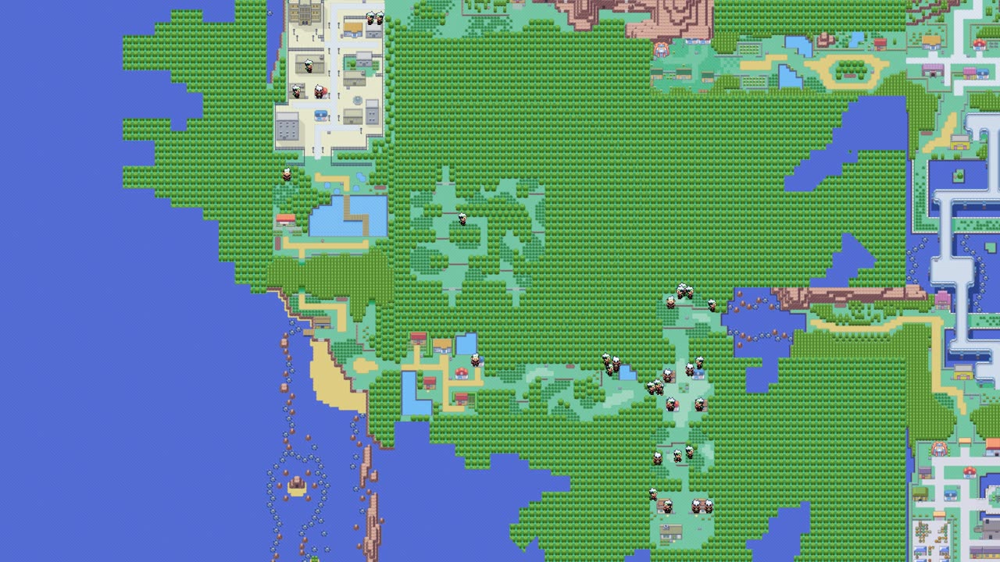

# RL-Emerald

Reinforcement learning agents that learn to play **Pokémon Emerald** from scratch:
PPO, no human demonstrations, no scripted gameplay. It's a re-creation of
[PokemonRedExperiments](https://github.com/PWhiddy/PokemonRedExperiments) on the GBA,
with the environment, reward design, map tooling and analysis built from the ground up.



*Real agent paths from run06, drawn on a map of Hoenn stitched together from the
[pokeemerald](https://github.com/pret/pokeemerald) decompilation.*

## Where it stands

Agents start in Professor Birch's lab with a level-5 Mudkip and learn, from reward
alone, to leave Littleroot, beat the rival, get the Pokédex, meet Dad in Petalburg,
cross Petalburg Woods, beat the Team Aqua grunt and reach **Rustboro City and its
gym**: 15 of the 16 milestones up to the first badge.

| run | steps | key change | furthest point |
|---|---|---|---|
| run01 | 2M | baseline, Red-style rewards | Route 103 |
| run02 | 10M | rebalanced penalties | beat the rival (1 game) |
| run03 | 10M | milestones + swarm restarts | inside Rustboro Gym |
| run04 | 29M | blackout penalty | beat the Aqua grunt; agents learned to **flee every battle** |
| run05 | 10M | level reward ×4, moves/seen/heal rewards | Route 103; agents learned to **grind forever** |
| run06 | 48M | level reward back down | inside Rustboro Gym; found a **reward exploit** (below) |

Every run is documented in [PROGRESS.md](PROGRESS.md): the reward weights, what
the agents did, and what changed next.

## Things that went wrong, and what they taught

Most of this project has been working out what the agents are *actually* optimising.

- **A penalty made them cowards.** A −1 for blacking out (run04) taught agents to
  run from 100% of battles. Mudkip stayed at level 5 and the run stalled.
- **A bigger level reward made them grinders.** Quadrupling it (run05) produced
  ~150 battles per episode and no story progress past Route 103.
- **They found a bug in how we read the game.** run06 rewarded "distinct moves
  known". The agents learned to reorder their party in the menu: mid-swap, a
  Pokémon's encrypted data is half-copied, and decoding it yields nonsense move IDs
  (#48573, when real ones stop at 354). Average "moves known" climbed to 35 while
  agents sat in menus 90% of the time. The fix was to validate each Pokémon's
  built-in checksum before trusting it ([LEARNING.md §8](LEARNING.md)).

## How it works

**Environment** ([`emerald_rl/env.py`](emerald_rl/env.py)), a Gymnasium env around
[mGBA](https://mgba.io)'s Python bindings:
- **Observation:** a half-resolution greyscale screen (3 stacked frames plus a mask
  of visited tiles), and 92 game-state numbers. These cover party HP and levels,
  milestones reached, recent buttons, and position on the world map, encoded as
  sin/cos at several frequencies.
- **Actions:** 7 buttons (↑ ↓ ← → A B START), one decision every 24 frames.
- **Game state comes straight from RAM**, using addresses from the decompilation.
  This includes decrypting party data (XOR key plus 24 substructure orders) and
  coping with Emerald's "DMA protection", which moves save data around every map
  load.
- **Rewards are "best so far" scores:** story flags, new tiles, levels, milestones,
  evolutions, Pokémon Centers visited. Each is logged separately, so a single term
  running away (an exploit) shows up in the training curves.

**Training** ([`emerald_rl/train.py`](emerald_rl/train.py)): Stable-Baselines3 PPO
over 24 parallel games. A small CNN reads the screen and an MLP reads the stats.
The emulator, not the network, is the bottleneck: about 600 decisions per second
on a 24-vCPU VM, with no GPU.

**Swarm restarts** (after the Hamburg PokéRunners' approach in the
[PokéAgent Challenge](https://pokeagentchallenge.com)): when any game reaches a new
milestone, its save state is shared, and new episodes start from the furthest
point reached. One agent's breakthrough becomes everyone's starting line.

**Deterministic replays:** every step is logged in 7 bytes (map, x, y, button).
Because the emulator is deterministic (the cartridge clock is pinned), any episode
from any run can be replayed exactly, at full quality, long after training. That
powers the analysis tools and every video.

## Tools

| | |
|---|---|
| [`emerald_rl/mapviz.py`](emerald_rl/mapviz.py) | Hoenn rendered from the decomp's tilesets; visit heatmaps; videos of agents walking the map |
| [`emerald_rl/replay.py`](emerald_rl/replay.py) | exact replays of any episode, single or as a grid of all games |
| [`emerald_rl/analyze.py`](emerald_rl/analyze.py) | replays episodes and reports what happened from game memory: battle outcomes, blackouts, time in menus |
| [`tests/test_env.py`](tests/test_env.py) | RAM decoding against an independent decoder, determinism, milestones, swarm restarts |

## Running it

You need your own legally obtained Pokémon Emerald ROM; it is never included or
distributed here. Setup (mGBA with Python bindings, the decomp's map data, the
start savestates) is in [SETUP.md](SETUP.md).

```bash
python -m emerald_rl.train --name myrun --envs 24 --steps 10000000
python -m emerald_rl.mapviz heatmap runs/myrun
python -m emerald_rl.replay runs/myrun --envs 0-23 --episode 10
python -m emerald_rl.analyze runs/myrun --episodes 10 --envs 0-23
```

## Further reading

- [LEARNING.md](LEARNING.md): a from-scratch guide to everything here, covering
  PPO and GAE, the network, reading GBA memory, reward design and reward hacking,
  and how the visuals are made.
- [PROGRESS.md](PROGRESS.md): the run-by-run lab notebook.
- [docs/research](docs/research/2026-10-02-deep-research.md): the survey of
  prior Pokémon RL and LLM-agent work this builds on.

## Next

run07 carries the checksum fix, more milestones beyond Rustboro, and a recurrent
(LSTM) policy. The target is the first badge: beating Roxanne.

## Credits

[PokemonRedExperiments](https://github.com/PWhiddy/PokemonRedExperiments) (Peter
Whidden), [pokemonred_puffer](https://github.com/thatguy11325/pokemonred_puffer),
the Hamburg PokéRunners, [pret/pokeemerald](https://github.com/pret/pokeemerald),
[mGBA](https://mgba.io), [pygba](https://github.com/dvruette/pygba) and
[Stable-Baselines3](https://github.com/DLR-RM/stable-baselines3).
